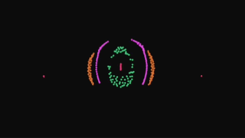
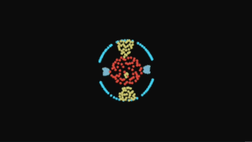

# ☄️ particle-life
> Try now (page) -<br> [artony4444.github.io/particle-life](https://artony4444.github.io/particle-life/) <br> <br>
Contact me -<br> [artony4444@gmail.com](mailto:artony4444@gmail.com)

##
## examples

IMAGE 1
```
this.rule = [[0.3424917974074637,-0.34930799596464784,0.3548724819672413,0.3976379866825952,0.2820004018327019,0.3819007211052363],[0.03602084124323257,-0.237672647227762,0.3194886888633932,-0.6391383103768179,0.16772332928817824,0.4586195212202877],[0.4028250606822654,0.2805991560798431,0.47372507371872863,0.46692368582500565,0.2538742481744757,0.19995782648171756],[-0.6545660478169739,-0.45227578775872,0.5748178620671103,-0.08169267274234482,-0.13543417506799404,-0.5023547561228248],[-0.42722916260340354,0.6203391135348757,-0.15440846764252503,-0.44088413262749804,0.019573680542387395,0.6196616068580738],[-0.36488119160569643,-0.04669796753883293,-0.4871183877795052,-0.01635982466936714,-0.5507396991835529,-0.26898827290236]]
```
> copy paste rule at : `src/js/engine/engine.js/particleInit()` <br>

 

<br> <br> <br> 

IMAGE 2
```
this.rule = [[0.2036769408457033,0.9898788393481217,-0.04979607740020464,0.8151489340329898,-0.22318364438075733,0.7067149442650034],[-0.8622773506370343,-0.16487011202600366,0.2763383016949219,-0.39724838304358867,-0.8814852523394121,-0.9663600267231907],[-0.4779788761343524,-0.9018475319620647,0.47748326079398495,-0.8262732851340386,-0.3981230499607742,-0.10930582023670832],[-0.03873341902046645,-0.31744876659151133,-0.718049995361183,0.16708848453789615,0.3428669841370544,0.886567154528282],[0.1608564388544096,-0.08440039970598123,-0.06847844403537318,0.8030419096042727,0.4609558982441575,-0.0338310837913256],[0.6944575535905297,0.835697719539517,0.33970441797530704,0.275073977852863,0.24622764418961385,-0.3302563642654057]]
```
> copy paste rule at : `src/js/engine/engine.js/particleInit()`

 <br>
